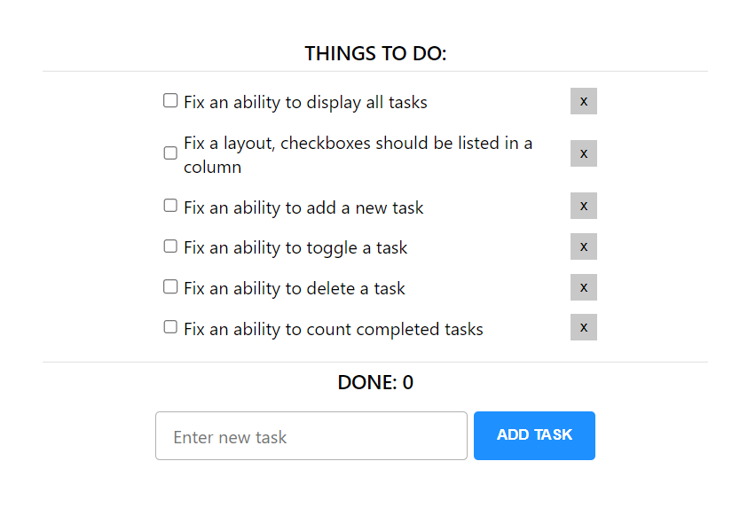

# Broken React TO DO application based on context api

This application was intentionally broken, there are six critical issues that you need to fix:

**_1. Fix an ability to display all tasks. `[done]`_**

In order to fix the ability to display all the tasks, a `todosTemplate` array was passed as an initial state in the `todos` state variable in app.jsx to render an initial array of objects as todos.

_`Rendered todos`_


**_2. Fix a layout, checkboxes should be listed in a column. `[done]`_**

To enlist the todos in a column format, `flex-direction` property of flexbox layout was used with the value set to `column` in todo-list.scss file to render the tasks column-wise.

**_3. Fix an ability to add a new task. `[done]`_**

First of all, `setTodos` state variable update function was passed as a prop in `TodosContext.Provider`, in app.jsx file, which allowed the children components to receive setTodos function as a prop. To fix the ability to add a new task, a callback function inside setTodos receives all previous array of objects which was used to add a new to-do in an existing array of objects using the spread operator to get the previous objects and return a new array with the new to-do attached as the array's last object.

_`Logic to add a new to-do`_

```
    setTodos((prevTodos) => [
      ...prevTodos,
      {
        checked: true,
        id: prevTodos.length,
        label: task,
      },
    ]);
  };
```

**_4. Fix an ability to toggle a task. `[done]`_**

To toggle a task, its `checked` property value needs to be flipped from `existing true to false or false to true` and to achieve this the `setTodos` function is needed to map over the entire array of todo objects to find a to-do that matches with the `id` passed as a parameter. And once the id matches, we can take all other properties of this object as it is and only change its `checked` property while returning all other objects as it is whose ids were not matched.

_`Logic to toggle a task`_

```
    setTodos((oldTodos) =>
      oldTodos.map((todo) => {
        return todo.id === id ? { ...todo, checked: !todo.checked } : todo;
      }),
    );
```

**_5. Fix an ability to delete a task. `[done]`_**

To delete a task, the `setTodos` function can be used to filter the `todos` array based on the id taken as a parameter using JavaScript `filter` method to iterate over an entire array of objects to only return the objects whose ids do not match with the parameter id.

_`Logic to delete a task`_

```
    setTodos((prevTodos) => prevTodos.filter((prevTodo) => prevTodo.id !== id));
```

**_6. Fix an ability to count completed tasks. `[done]`_**

To count the number of completed tasks, JavaScript's `filter` method can be used again to filter over the array of todo objects and getting the length of the objects with `checked` property value set to `true`.

_`Logic to count completed tasks`_

```
    const todosCompleted = todos.filter((todo) => todo.checked === true).length;
    return todosCompleted;
```

## Available Scripts

Use `npm start` to run project.
